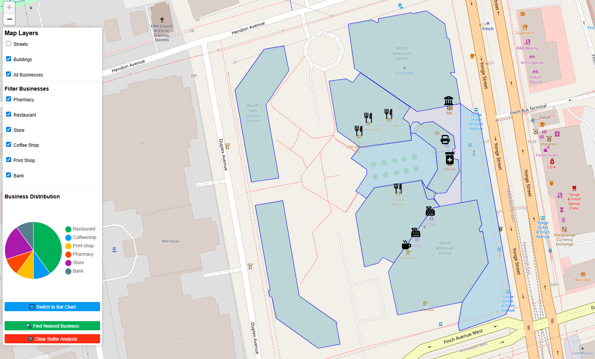
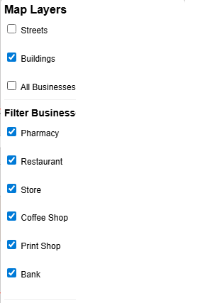
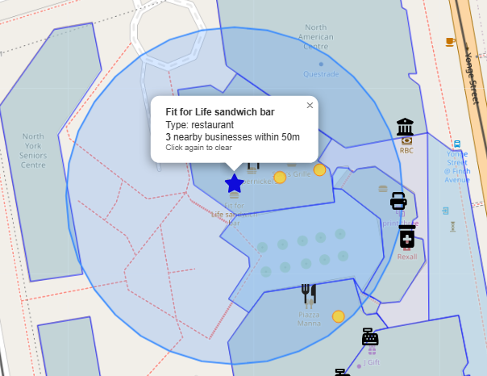
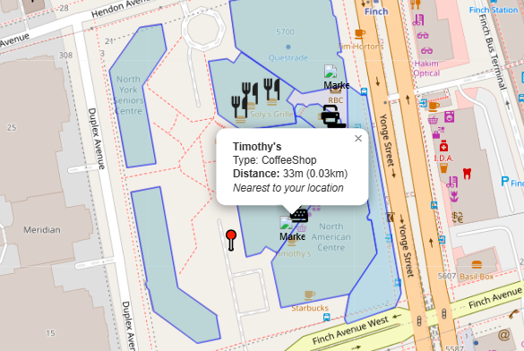
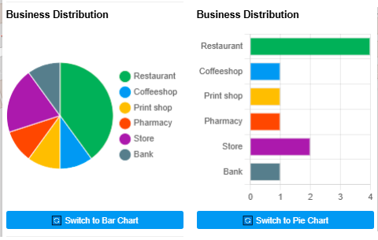
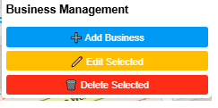
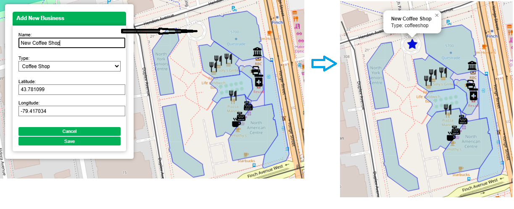
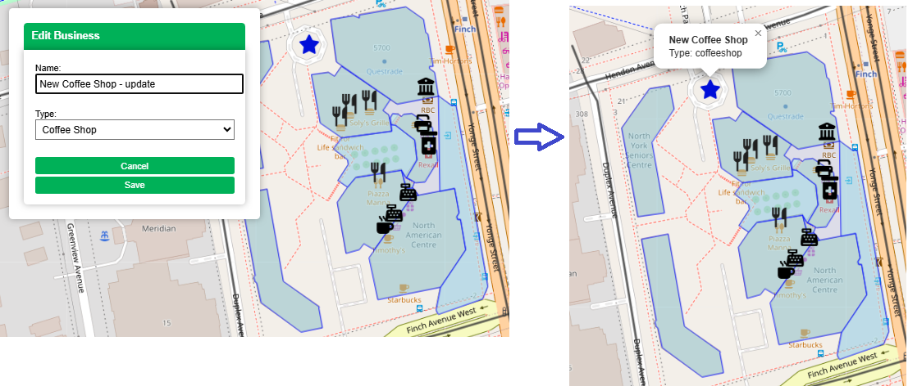
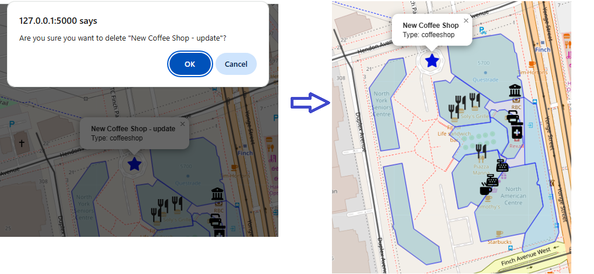

# 🚀 Advanced GIS WebApp – Phase 2: Dynamic GIS API with Flask & PostGIS

This is the **second phase** of a modern multi-part GIS web application. It introduces a dynamic backend using **Flask** and **PostgreSQL/PostGIS**, enabling real-time CRUD operations, API-driven map updates, and advanced spatial logic. It extends the static frontend from [Phase 1](https://github.com/essamun/Advanced-GIS-WebApp-Frontend) into a fully interactive GIS web service.

> 📍 Real GIS functionality. Full-stack architecture. Built with production-ready technologies.

---

## 🌍 Live Demo (Coming Soon)
📎 Hosted on [Render](https://render.com) — coming soon after deployment.

---

## 🧰 Tools & Technologies

- **QGIS** – Digitizing and spatial data prep
- **PostgreSQL + PostGIS** – Spatial database engine
- **Flask** – Lightweight Python web framework for the GIS API
- **Leaflet.js** – Map rendering and UI interactivity
- **Chart.js** – Dynamic business-type charts
- **Shapely** – Python geometry analysis (buffer, nearest point)
- **Turf.js** – Client-side geoprocessing

---

## 🗂️ Features

| Category | Description |
|---------|-------------|
| 🗺️ **Dynamic GIS Map** | Loads data from live Flask API endpoints |
| 🔁 **CRUD Operations** | Add, edit, delete businesses with map interaction |
| 🧭 **Nearest Business Tool** | Click to find and highlight nearest business |
| 🎯 **Buffer Analysis** | Click on a business and find nearby businesses within 50m |
| 📊 **Charts with Toggle** | Pie + Bar chart views of business types |
| 🔎 **Layer & Type Filters** | Interactive sidebar for toggling visibility |
| 🧱 **Modular Codebase** | Split JS into reusable components; external CSS |

---

## 🖼️ Screenshots

| Feature | View |
|--------|------|
| App Overview |  |
| Business Filtering |  |
| Buffer Zone Tool |  |
| Nearest Business Tool |  |
| Chart Toggle |  |
| CRUD Controls |  |
| Adding Business |  |
| Updating Business |  |
| Deleting Business |  |

---

## 📁 Folder Structure

Advanced-GIS-WebApp-Backend/
├── static/
│ ├── css/
│ │ └── styles.css
│ ├── js/
│ │ ├── components/
│ │ │ ├── map.js
│ │ │ └── utils.js
│ │ └── main.js
│ └── images/
├── templates/
│ └── index.html
├── app.py # Flask application logic (API + routing)
├── requirements.txt # Python dependencies
├── README.md
└── screenshots/ # Screenshots for documentation


---

## 🛠️ Setup & Installation

### 1. Clone the Repo

```bash
git clone https://github.com/essamun/Advanced-GIS-WebApp-Backend.git
cd Advanced-GIS-WebApp-Backend

2. Create Virtual Environment

python -m venv venv
venv\Scripts\activate  # On Windows

3. Install Requirements

pip install -r requirements.txt


4. Setup PostgreSQL/PostGIS
Install PostgreSQL and PostGIS on your system

Create a database and enable PostGIS:

CREATE EXTENSION postgis;


Update app.py to point to your connection string

python app.py
Then open http://localhost:5000 in your browser.

---

## 📌 About the Author

👤 Essam Afifi
Canadian Data & AI Consultant | GIS Developer | Full-Stack Engineer
MSc in Geomatics | PMP® Certified | 20+ Years of Experience
Fluent in English 🇬🇧, French 🇫🇷, and Arabic 🇪🇬

Built this project end-to-end — from spatial digitization in QGIS to a full-stack GIS web application powered by Flask and PostGIS. Skilled in combining GIS, web technologies, and machine learning to deliver smart spatial solutions.

🌍 [Essam Afifi](https://www.linkedin.com/in/essam-afifi-a38a3a362/)
📫 esstoronto@gmail.com

---

🔭 Part of a Multi-Phase GIS Project
This is Phase 2 of a complete GIS solution:

✅ Phase 1 – Static GIS Frontend

🔁 Phase 2 – Flask + PostGIS Backend (this repo)

🧠 Phase 3 – Coming soon: ML-powered spatial clustering and predictive GIS tools

🙌 Contributions
Built using real-world use cases near Toronto (Yonge & Finch), this project simulates how spatial databases and web tools come together to power modern GIS workflows.

